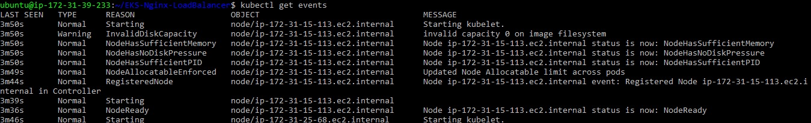
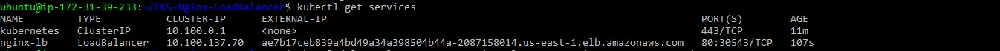
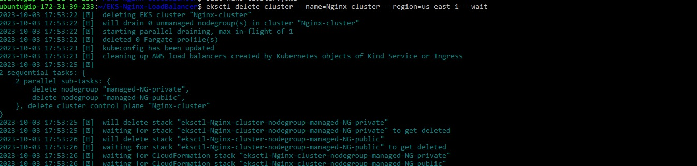

# EKS-Nginx-LoadBalancer

This project seeks to deploy a simple Nginx web server on an EKS cluster and expose it to the internet using a Load Balancer. It makes use of the following tools:

- [Eksctl](https://eksctl.io/)
- [Kubectl](https://kubernetes.io/docs/tasks/tools/install-kubectl/)
- [AWS CLI](https://docs.aws.amazon.com/cli/latest/userguide/cli-chap-install.html)

## Prerequisites

To setup this project, you need to have the following:

- An AWS account: You can create on using the aws console [here](https://aws.amazon.com/console/).
- Install the AWS CLI: You can follow the instructions [here](https://docs.aws.amazon.com/cli/latest/userguide/cli-chap-install.html).
- Install eksctl: You can follow the instructions [here](https://eksctl.io/).
- Install kubectl: You can follow the instructions [here](https://kubernetes.io/docs/tasks/tools/install-kubectl/).

## Setup

- Clone this repository to your local machine.

  ```bash
  git clone https://github.com/Aahil13/EKS-Nginx-LoadBalancer.git
  ```

- Create an EKS cluster using the command below:

  ```bash
  eksctl create cluster -f cluster.yaml
  ```

  

- Deploy the Nginx web server using the command below:

  ```bash
  kubectl apply -f NGINX-depl.yaml
  ```

- Confirm that all events were successful using the command below:

  ```bash
  kubectl get events
  ```

  You should see a similar response:

  

- Check the status of the deployment using the command below:

  ```bash
  kubectl get deployments
  ```

- Get the external IP address of the Load Balancer using the command below:

  ```bash
  kubectl get services
  ```

  You should see a response similar to the one below:

  

- You can visit the web server using the external IP address of the Load Balancer.

  

- Make sure to delete the cluster after you are done using the command below:

  ```bash
  eksctl delete cluster --name=Nginx-cluster --region=us-east-1 --wait
  ```

  

## Author

This project was completed by [Aahil](https://www.linkedin.com/in/prince-onyeanuna-607352246/) and assigned by [Francis](https://www.linkedin.com/in/osemhenkan-iduh).
